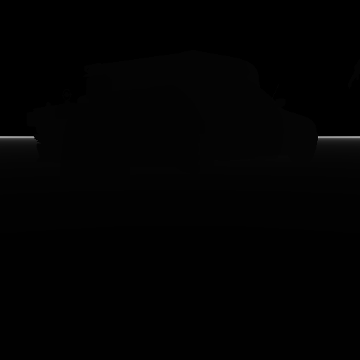
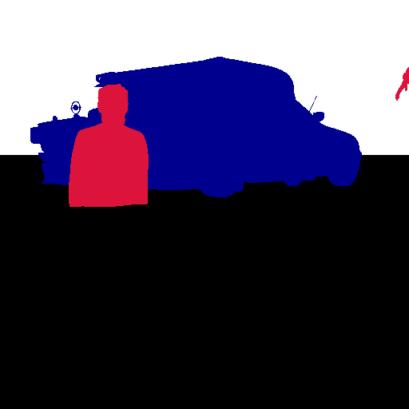
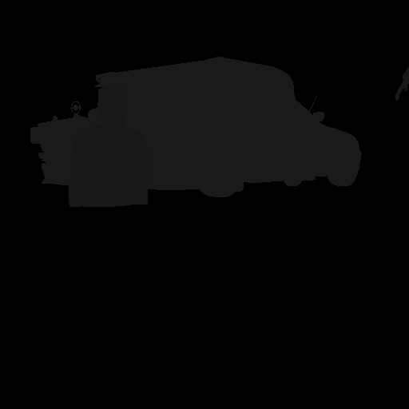

# Example Dataset

This directory contains a small, sample dataset generated by the `randomize.py` script to demonstrate its output capabilities. The dataset was generated with `num_frames=10` and follows the **Kitti** data format, which includes RGB images, depth maps, segmentation masks, and object detection labels.

## Dataset Structure Overview

The generated data is organized into a main folder, `kitti-dataset`, which contains the output from a single camera (`Camera`). Inside, you will find different data types, each in its own subdirectory. All data is synchronized by frame number, meaning `rgb/0.png` corresponds to `depth/0.png`, `object_detection/0.txt`, and so on.

---

### **1. RGB Images**

This is the primary visual output of the simulation.

-   **Location:** `kitti-dataset/Camera/rgb/`
-   **Format:** `.png`
-   **Description:** Standard color images of the scene.

| Example RGB Image (`rgb/0.png`) |
| :----------------------------------------------------------: |
|  |

---

### **2. Object Detection Data**

This is the core data used for training object detection models. It contains the class, position, dimensions, and orientation of each labeled object in the scene.

-   **Location:** `kitti-dataset/Camera/object_detection/`
-   **Format:** `.txt`
-   **Description:** Each line in a text file corresponds to a single object in the frame. The format includes both 2D and 3D bounding box information.

**Format:**
`class_name truncated occluded alpha bbox_xmin bbox_ymin bbox_xmax bbox_ymax h w l x y z ry`

-   **`class_name`**: The semantic label (e.g., `car`, `person`).
-   **`bbox_xmin ... bbox_ymax`**: The 2D bounding box in pixel coordinates.
-   **`h, w, l`**: The 3D dimensions (height, width, length) in meters.
-   **`x, y, z`**: The 3D location of the object's base in camera coordinates.
-   **`ry`**: The rotation (yaw) of the object.

**Example (`object_detection/0.txt`):**
```
car 0.00 0 0.00 250.00 185.00 350.00 260.00 1.50 1.80 3.00 5.20 0.50 10.00 1.57
person 0.00 0 0.00 450.00 200.00 500.00 350.00 1.70 0.60 0.50 4.80 -1.20 9.50 -0.87
```

---

### **3. Depth Maps**

Depth maps provide the distance from the camera to every pixel in the scene.

-   **Location:** `kitti-dataset/Camera/depth/`
-   **Format:** `.png`
-   **Description:** Grayscale images where pixel intensity corresponds to distance. Brighter pixels are closer to the camera, and darker pixels are farther away.

| Example Depth Map (`depth/0.png`) |
| :----------------------------------------------------------: |
|  |

---

### **4. Segmentation Masks**

The writer generates several types of segmentation masks, which are useful for different machine learning tasks. Each type uses color to identify different elements in the scene.

| Semantic Segmentation (`semantic_segmentation/0.png`) | Instance Segmentation (`instance_segmentation/0.png`) |
| :----------------------------------------------------------: | :----------------------------------------------------------: |
|  |  |

-   **Semantic Segmentation (`semantic_segmentation/`)**
    -   **Purpose:** Assigns a specific color to every pixel based on its **class**. For example, all `car` objects will be one color, and all `person` objects will be another color. The ground plane will have its own color.
-   **Instance Segmentation (`instance_segmentation/`)**
    -   **Purpose:** Assigns a unique color to each **instance** of an object. For example, if there are two cars in the scene, they will have two different colors to distinguish them from each other.
