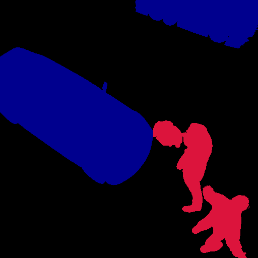
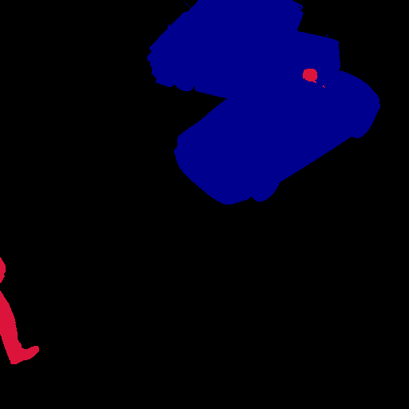
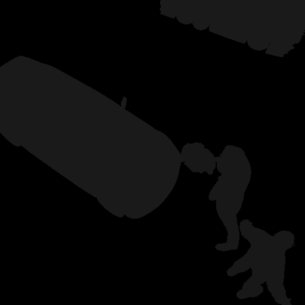

# Kitti Example Dataset

This directory contains a small, sample dataset generated by the `randomize.py` script to demonstrate its output capabilities. The dataset was generated with `num_frames=10` and follows the **Kitti** data format, which includes RGB images, depth maps, segmentation masks, and object detection labels.

## Dataset Structure Overview

The generated data is organized into a main folder, `kitti-dataset`, which contains the output from a single camera (`Camera`). Inside, you will find different data types, each in its own subdirectory. All data is synchronized by frame number, meaning `rgb/0.png` corresponds to `depth/0.png`, `object_detection/0.txt`, and so on.

---

### **1. RGB Images**

This is the primary visual output of the simulation. Notice how the camera position and the placement and rotation of the assets change in every frame. (Notice also that one person is positioned below the surface due to issues with the usdz model and our failure to detect how to place it)

-   **Location:** `kitti-dataset/Camera/rgb/`
-   **Format:** `.png`

| Frame 0 | Frame 1 | Frame 2 |
| :---: | :---: | :---: |
|  |  |  |

---

### **2. Object Detection Data**

This is the core data used for training object detection models. It contains the class, position, dimensions, and orientation of each labeled object in the scene.

-   **Location:** `kitti-dataset/Camera/object_detection/`
-   **Format:** `.txt`

**Format:**
`class_name truncated occluded alpha bbox_xmin bbox_ymin bbox_xmax bbox_ymax h w l x y z ry`

-   **`class_name`**: The semantic label (e.g., `car`, `person`).
-   **`bbox_xmin ... bbox_ymax`**: The 2D bounding box in pixel coordinates.
-   **`h, w, l`**: The 3D dimensions (height, width, length) in meters.
-   **`x, y, z`**: The 3D location of the object's base in camera coordinates.
-   **`ry`**: The rotation (yaw) of the object.

**Example (`object_detection/0.txt`):**
```
car 0.00 0 0.00 250.00 185.00 350.00 260.00 1.50 1.80 3.00 5.20 0.50 10.00 1.57
person 0.00 0 0.00 450.00 200.00 500.00 350.00 1.70 0.60 0.50 4.80 -1.20 9.50 -0.87
```

---

### **3. Depth Maps**

Depth maps provide the distance from the camera to every pixel in the scene. Brighter pixels are closer to the camera, and darker pixels are farther away.

-   **Location:** `kitti-dataset/Camera/depth/`
-   **Format:** `.png`

| Frame 0 | Frame 1 | Frame 2 |
| :---: | :---: | :---: |
|  |  |  |


---

### **4. Segmentation Masks**

The writer generates several types of segmentation masks, which are useful for different machine learning tasks. Each type uses color to identify different elements in the scene.

#### **Semantic Segmentation**
Assigns a specific color to every pixel based on its **class**. All `car` objects will be one color, and all `person` objects will be another.

-   **Location:** `kitti-dataset/Camera/semantic_segmentation/`
-   **Format:** `.png`

| Frame 0 | Frame 1 | Frame 2 |
| :---: | :---: | :---: |
|  |  |  |

#### **Instance Segmentation**
Assigns a unique color to each **instance** of an object. If there are two cars in the scene, they will have two different colors to distinguish them.

-   **Location:** `kitti-dataset/Camera/instance_segmentation/`
-   **Format:** `.png`

| Frame 0 | Frame 1 | Frame 2 |
| :---: | :---: | :---: |
|  |  |  |

---

# **Example YOLO Dataset**

After running the `kitti_to_yolo.py` script on the generated Kitti data, a new, self-contained and portable `yolo_dataset` is created. This dataset is in the correct format for training modern object detection models like YOLOv5, YOLOv8 and YOLO11.

## Dataset Structure

The `yolo_dataset` directory is organized into a standard structure that YOLO frameworks expect:

-   **`data.yaml`**: The master configuration file that describes the dataset.
-   **`images/`**: Contains all the `.png` image files.
    -   **`train/`**: Images for the training set.
    -   **`valid/`**: Images for the validation set.
-   **`labels/`**: Contains all the corresponding `.txt` label files.
    -   **`train/`**: Labels for the training images.
    -   **`valid/`**: Labels for the validation images.

---

## **1. The `data.yaml` File**

This is the most important file. It tells the training script where to find the images and what the class names are. The paths are relative, making the entire folder portable.

**Content of `data.yaml`:**
```yaml
train: images/train
val: images/valid
nc: 2
names:
  0: person
  2: car
```
-   **`train` & `val`**: Point to the directories containing the training and validation images.
-   **`nc`**: The total number of classes (in this case, 2).
-   **`names`**: The mapping from the numeric `class_id` to the human-readable class name. Note that these follow the **COCO dataset standard**.

---

## **2. YOLO Labels (`labels/`)**

Each `.txt` file contains the labels for the corresponding image. Each line represents one object in the YOLO format:

`class_id center_x center_y width height`

-   **`class_id`**: The integer ID for the class (e.g., `0` for person, `2` for car).
-   **`center_x, center_y, width, height`**: Normalized coordinates of the bounding box, where all values are floats between 0 and 1.

**Example (`labels/train/0.txt`):**
```
2 0.458 0.612 0.250 0.210
0 0.715 0.550 0.110 0.380
```

---

## **3. Training Images (`images/`)**

These are the same RGB images from the Kitti dataset, now split into `train` and `valid` sets for the training process.

| Training Frame 0 | Training Frame 1 | Training Frame 2 |
| :---: | :---: | :---: |
|  |  |  |

## **How to Use This Dataset for Training**

With this structure, training a YOLOv8/YOLO11 model is a single command. Simply point the training script to the `data.yaml` file:

```bash
yolo train data=/path/to/your/examples/yolo_dataset/data.yaml model=yolov8n.pt epochs=100 imgsz=640
```
